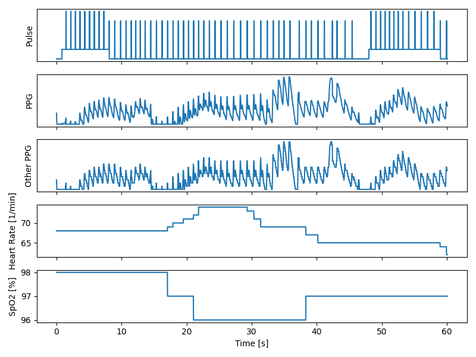

AQWaver - Reverse Engieered Code for the AQWave RX101 PPG Recorder
==================================================================

The [reflex AQ-Wave PPG Recorder](https://www.reflexwireless.com/en/aqwave-ppg-recorder/)
is a clip-on PPG recording device, which has USB and Bluetooth connectivity as well as standalone capabilities.
It can record SpO2 and heart-rate and shows the PPG curve.
I can not say, if the device ever entered production phase, because I own a "Beta Testing" unit (Model Number: RFX-SPO2-BETA12) - even though
I ordered it in their shop in 2012.
Some more information about the device can be found on the [FCC Website](https://fccid.io/P6S-RX101A).

The company ReFleX Wireless provides two types of Android app and a Windows application to communicate with the device.
However, none of these apps have a rich feature set and back in the days when the device entered the marked,
it was offered with a SDK, to build custom personal-health-solutions.
Unfortunately, this SDK never showed up and the company does not respond to mails since a few years now.

I tried to collect as much information about the device as possible, before the original website goes eventually down.
Some websites are already down and links end up 404.
Fortunately for the reverse-engineer, ReFleX Wireless messed up their build system for the Windows program (I do not
think that this was on purpose!) and included the full C# source code.

From that source code, it was possible to get basic functionality on the serial port working and also
find more commands to which the device responds and sends useful information.
I guess that there are even more commands available, however I could not find much more.
It would be interesting to have write capabilities on the device, and I guess that there are commands to do that.

This python library shows the basic functionality, which is partially created from the original source code and
partially reverse-engineered.

Demo Code
=========

To show the capabilities, here is an example of a recording of 60s:

During the test, I held my breath for about 20s. Can you see where?
I also did a Valsalva maneuver for about 5s. Can you also see the location?
You can also see the breathing cycles (which is a bit weird because of the two tests I did).

This demo shows also the limitations of the device. Note the lost pulse between 45 and 50s.
No - I did not had arrythmia ;)
Note, that the PPG dropped to zero at the same time. The reason is that during the Valsalva maneuver,
the blood pressure increases - you can clearly see this in the PPG signal.
But when the air is released from the lungs, the pressure decreases again. However,
the sensor is not giving an absolute signal but a relative one and is probably constantly re-calibrating
itself. Therefore the pressure difference was so big and the PPG signal was lost.

However, the increase in heart rate during breath holding as well as the decline in oxygen saturation is
clearly visible and matches the description in textbooks, of being "in the range of 20s" [0].

(holding breath: 10-30s, Valsalva: 40-45s)
 

Device Specs
============

* Based on TI MSP430F247
* OLED Solomon Systech SSD1351U
* 1.78Wh LiPo
* Sampling Rate: 1/60 per second
* Recording Sampling Rate: ~1Hz
* PPG Resolution: 8bit (maybe only 4 bit?)
* USB-Serial Interface: via CP210x
* Bluetooth-Serial Interface: Device Name `SpO2`, Pairing Key `7762`
  The device in the AQWave is a  BF10-A by Shenzhen Lansefeiwu Technology Co., Ltd. ([FCC Information](https://fccid.io/N8DBF10-A)).

Note that the device has a MiniUSB but does not speak USB!
You need the USB-Serial converter, which comes with the device.
However, it will charge from a normal USB Port just fine.

Serial Package Format
---------------------

The serial communication works using "packages".
You can request something using this package format and will also receive data in this format.
The packages have a type and a sign flag, which is explained later.
The minimal length of the package is two bytes, the maximal length is 9 bytes (probably 10 bytes).
There are packages of various lengths and some commands return multiple packages as well.
Length is not coded in the package itself and some commands even return a variable amount
of packages (However in this special instance, you can calculate the number of bytes to read).
Thus, you have to know the length of a packet in advance!

The general package format is:

    | 00 | 01 | 02 | 03 | 04 | 05 | 06 | 07 | 08 |
    +----+----+----+----+----+----+----+----+----+
    |type|sign| d0   d1   d2   d3   d4   d5   d6 |
    +----+----+----+----+----+----+----+----+----+

That means, there are 7 byte of data in the package
The flag controls if each byte of the data array is signed or unsigned.
If the i-th bit in the sign flag is one, the i-th data entry is unsigned.
Otherwise (if the i-th bit is zero), you have to subtract 128 from it to get a signed integer.

In all instances we have recorded, the sign bit has always MSB==1.
While in theory a package can be 10 bytes long, most packages are only 8 or 9 bytes.
My theory is, that the sign bit has only 7 "useable" bits, because they set MSB to one.
Therefore, the packages only have 7 payload bytes.
In the recording structure, the payload is only 6 bytes instead of 8, which indicates
that the payload must not exceed 7 bytes.

The original source code does not tell us what the package length is or how it is calculated,
they only reserve 9 bytes per package.

Strings are encoded as ASCII in the data. It looks like they are null-byte terminated, however some strings
are also prefixed with null-bytes.

Commands
========

To send a command to the device, you have to use package type `0x7d`. It seems to not matter how many filling bytes are
send in the package, as long as the package is not longer than 9 bytes, the command is understood.

According to the original source code, a package should look like this:

    0x7d 0x81 0xa9 0x80 0x80 0x80 0x80 0x80 0x80
    |     |    |    \                        /
    |     |    |     +-------- zeros -------+
    |     |    |
    |     |    +---> Command 0xa9 - Get Device Manufacturer
    |     +---> Bitmask 0b10000001, MSB has to be 1, First data byte (LSB of flag) is not signed
    +---> "Read Request" type

Because only the LSB of the sign flag is set, `0xa9` decodes as `0xa9` while `0x80` decodes as `0x00`.

You can also send the following command (which also illustrates the property of the sign flag):

    0x7d 0xff 0xa9 0x00 0x00 0x00 0x00 0x00 0x00
    
Because padding bytes do not matter, you can also send:

    0x7d 0x81 0xa9
    
which has the same effect.

Read Commands
-------------

I could find the following commands to work.
Some commands return always the same, some do return actual data.
Sometimes, command below `0x80` would return `0x0b 0x81 0x80 0x85` - however that might just be some glitch
where the receiver gets confused. On closer examination, commands below `0x80` would not return anything.

Several times, the a command `0xNN` would result in a package `0x0b 0x81 0xNN 0x85`. That  looks like an error package
which tells you "command not found".

With sign byte set to `0x81`:

Command | Response | Number of Packages | Comment
--- | --- | --- | --- 
`0x00` .. `0x7f` |    No Response
`0x80` .. `0x9f` |    `0x0b 0x81 0xNN 0x85` | | Command not found
`0xa0` | `0x06 0x80 0x80 0x87` | | ???
`0xa1`    | Package Type `0x01`     | n (9 bytes each) | Start PPG Recording (See description)
`0xa2` |   `0x0c 0x80`   | | Stop PPG Recording
`0xa3` | `0x0a 0x80 0x80 0x81` | | ???
`0xa4`    | Package Type `0x08`     | 1 (8 bytes)     | Number of Recorded Values (See description)
`0xa5`    | Package Type `0x07`, `0x0c`    | 2 (8 bytes each)        | Recording Time Setting
`0xa6`    | Package Type `0x0f`          | n (8 bytes each)      | Recorded Data (See description; During Recording, returns Error package)
`0xa7`    | `0x0c 0x80`   | | Stops the transmission of recorded packages
`0xa8`    | Package Type `0x02`     | 2 (9 bytes each)              | Seems to print the Device Name and type: First Package AQWave, second Package ÿRX101
`0xa9`    | Package Type `0x03`     | 1 (9 bytes)              | Get Device Manufacturer 'ReFleX\x00'
`0xaa`    | Package Type `0x04`     | 1 (9 bytes)              | Prints 'user' - also some kind of user id?
`0xab`    | Package Type `0x05`     | 1 (9 bytes)              | Device User ID
`0xac`    | `0x0e 0x80 0x81` | | ???
`0xad`    | `0x10 0x80 0x81` | | ???
`0xae`    |     `0x0b 0x81 0xNN 0x85` | | Command not found
`0xaf`    | No Response |         | "Keep Alive" during PPG Recording, is send by the app every 60 packages, i.e. every second
`0xb0`    | `0x11 0x80 0x81 0x81 0x80 0x80 x080 0x80 0x80` | | ???
`0xb1` .. `0xff` |     `0x0b 0x81 0xNN 0x85` | | Command not found

With sign byte set to `0x80`:

Command | Response
--- | ---
`0x00` .. `0x7f` |     No response
`0x80` .. `0xff` |     `0x0b 0x80 0xNN 0x85` | | Command not found

The original source code only uses (and defines) four commands:

* `0xa1` - start recording
* `0xaf` - keep recording alive
* `0xa9` - retrive device manufacturer (used to check if correct serial device is present)
* `0xab` - retrieve device user ID

Reading Data
------------

The device will spill out packages of data after being asked.
I found that it will send about 1790 packages and then stops automatically.
Maybe the timeout is set to exactly 30s but with jitter and overhead you end up with rougly 10 packets less.
Because sometimes the device will send 1791 or 1786.
To still retrieve packages, there is a "keep alive" command.
The original software issues this command every 60 packages, i.e., every second.

The original software only uses three of the five data fields: PPG, heart rate and SpO2.
However, there is also a field which can be used for pulse detection and a second PPG
signal, which looks like a downscaled version of the first one.

Reading Recorded Data
---------------------

During a recording, the device will answer commands as unknown. However, if the recording
is stopped on the device, the device will answer with all packages of recorded data.
Each package is 8 bytes long and contains three tuple of heart rate and SpO2 measurements.
Each tuple corresponds to a second.

You can ask the device how many values (not tuples!) it has stored and thus calculate the number of bytes
to read.
Note that the device will be blocked while recorded data is downloaded.
For a full day of recording, the download takes about 25s.
Because you might just want to check the command, if the device is currently recording,
there seems to be another command to abort the download.
However, after the command is send, you might receive 2 to 3 more data packages before the stream ends.

On the device, you can also set the time when the recorded started. The idea here is,
that the patient will set the time, record the data and then go to the PC and retrieve the sample.
In order to know when the recording has started, you set the time manually.

According to the manual, the device has 24h of storage.
This was tested and is true, after 24h of recording, the device will display a message that the memory
is full and will then have exactly 86400 seconds of recording stored.

Quirks
======

The device seems to be very buggy. I have firmware version 1.4w - maybe that is a very old version.
However, I found the following quirks:

* The display brightness is set incorrectly on startup and can be resolved (sometimes) by activating a recording on the device and waiting for the standby timer
* The framebuffer is not completely cleared and you can see sometimes pixels of old frames
* I once triggered a "freeze" of the device: It would not go into auto-suspend, would not show "Finger out" and would not measure any data.
  The PPG line would always show the last value, but would still render. It worked again by sending several commands. Unfortunately, I can not say which one unblocked it and which one froze it.
* When activating the recording while bluetooth is on, the settings menu show it off but when clicking on it it shows as on again
* The battery indicator shows always the same level

References
==========

[0] Kaniusas, E.: Biomedical Signals and Sensors I (2012), Springer-Verlag Berlin Heidelberg
DOI: [10.1007/978-3-642-24843-6](https://dx.doi.org/10.1007/978-3-642-24843-6)
